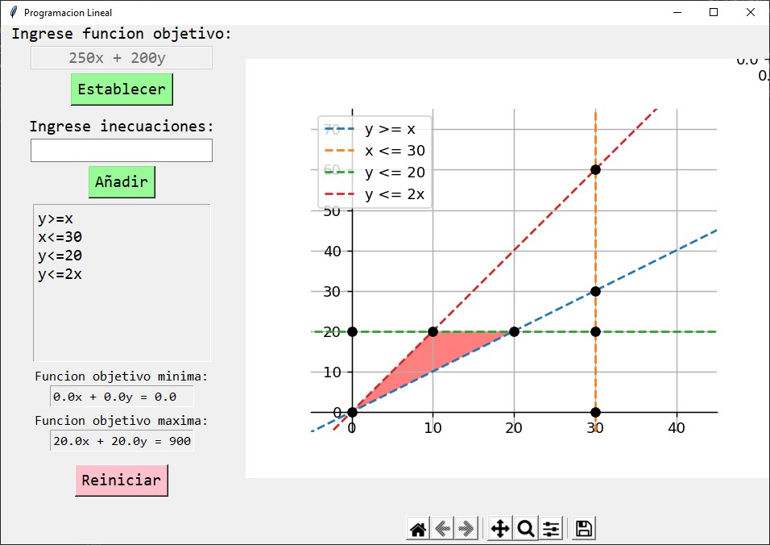

# Trabajo Final Algebra Lineal
## Links relevantes
 - [Informe del trabajo hospedado en Google Docs](https://docs.google.com/document/d/1wz5lCcAEdkf4cIfsV82gmEK3bgVXXY48zGP8AFVADYE/edit?usp=sharing)
 - [Ejecutable .exe hospedado en Google Drive](https://drive.google.com/file/d/1PRfeLjhGZXkbmDHgWtPPS0xK5niuAhS6/view?usp=sharing)

## Integrantes
- Francesco Bassino
- Renzo Mondragón
- Renzo Damián
- Randy Mayo
- Sergio Bazan

## Objetivo
Pida el ingreso de una función lineal de la forma 𝑓(𝑥, 𝑦) = 𝑎𝑥 + 𝑏𝑦 y de n inecuaciones lineales (n[3, 8]) que formen un polígono D (acotado o no). El programa debe determinar el valor mínimo y máximo de la función sobre el conjunto D (en caso existan).

## Ejecutar
```
python3 main.py
```
Escribir la funcion objetivo y las inecuaciones en el programa
## Grafico



## Requerimientos:
- python 3.7 o superior
- matplotlib
- numpy
